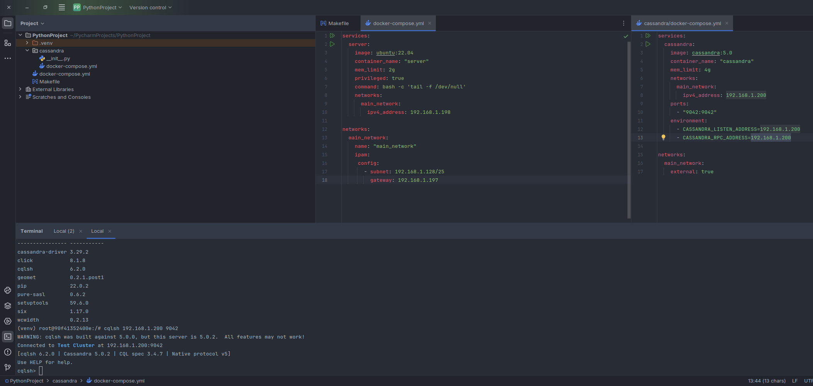

# Описание
В этом проекте развернут кластер Cassandra с помощью Docker Compose. Каждый инстанс будет доступен из локальной сети по отдельному IP-адресу.  
Этот проект предназначен для демонстрации процесса развертывания и подключения к Cassandra через cqlsh.

В данном проекте в качестве машины А - использовался сам пк с ubuntu 22.04, в качестве машины Б - docker образ ubuntu 22.04

Обе машины были подключены к одной сети  
```yml
services:
  server:
    image: ubuntu:22.04
    container_name: "server"
    mem_limit: 2g
    privileged: true
    command: bash -c 'tail -f /dev/null'
    networks:
      main_network:
        ipv4_address: 192.168.1.198

networks:
  main_network:
    name: "main_network"
    ipam:
     config:
       - subnet: 192.168.1.128/25
         gateway: 192.168.1.197
```

Для демонстрации используется только один контейнер Cassandra, из-за ограниченных ресурсов пк. Однако принцип развертывания и подключения остаётся тот же для трёх инстансов.
```yml
services:
  cassandra:
    image: cassandra:5.0
    container_name: "cassandra"
    mem_limit: 4g
    networks:
      main_network:
        ipv4_address: 192.168.1.200
    ports:
      - "9042:9042"
    environment:
      - CASSANDRA_LISTEN_ADDRESS=192.168.1.200
      - CASSANDRA_RPC_ADDRESS=192.168.1.200

networks:
  main_network:
    external: true
```

## Шаги по развертыванию

### Установка Docker
Перед запуском Docker Compose необходимо установить Docker.
```bash
sudo apt-get update
sudo apt-get install ca-certificates curl
sudo install -m 0755 -d /etc/apt/keyrings
sudo curl -fsSL https://download.docker.com/linux/ubuntu/gpg -o /etc/apt/keyrings/docker.asc
sudo chmod a+r /etc/apt/keyrings/docker.asc

# Add the repository to Apt sources:
echo \
  "deb [arch=$(dpkg --print-architecture) signed-by=/etc/apt/keyrings/docker.asc] https://download.docker.com/linux/ubuntu \
  $(. /etc/os-release && echo "$VERSION_CODENAME") stable" | \
  sudo tee /etc/apt/sources.list.d/docker.list > /dev/null
sudo apt-get update
```
Для установки на ubuntu данные пакеты зависимостей были взяты с оффициального сайта docker:  
https://docs.docker.com/engine/install/ubuntu/

### Активация docker
```bash
sudo systemctl start docker
```
### Активация контейнеров
```bash
docker compose up --build -d
docker compose -f cassandra/docker-compose.yml up --build -d
```
## #Активация bash оболочки сервера
```bash
docker exec -it server /bin/bash
```
### Установка зависимостей на сервер
Для доступа к cqlsh необъодимо установить на сервер python интерпретатор, виртуальное окружение venv и пакетный менеджр pip  
```bash
apt update
apt install -y python3 python3-pip python3-venv
```
### Создание и активация venv
```bash
python3 -m venv venv
source venv/bin/activate
```
### Установка cqlsh
```bash
pip install cqlsh
```
### Проверка работоспособности кластера
```bash
cqlsh 192.168.1.200 9042
```
###
### Итог

